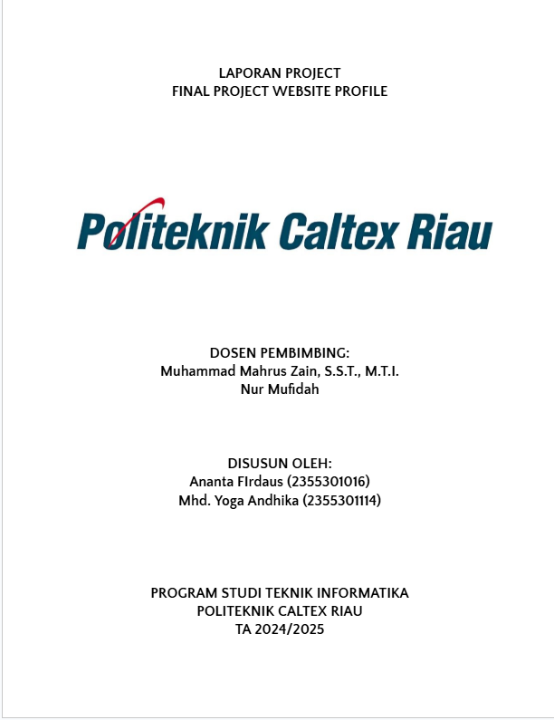

## BAB I Pendahuluan

## 1.1 Tujuan
Dokumen Final Project Website Profile merupakan dokumen yang menjelaskan pembuatan website profile bisnis Besi Tua. Tujuan dari pembuatan website profil bisnis besi tua adalah untuk memperkenalkan profil perusahaan kepada calon pelanggan secara luas melalui media digital. Selain itu, website ini bertujuan untuk memberikan informasi mengenai layanan yang ditawarkan, seperti jenis besi tua yang diterima, proses penjualan, dan prosedur pengangkutan. Dengan adanya website, perusahaan juga dapat Sj Bersama meningkatkan kepercayaan pelanggan melalui penyajian testimoni, sertifikasi, dan pengalaman bisnis.

## 1.2 Lingkup
Profil Bisnis Besi Tua merupakan aplikasi yang kami bangun untuk mempermudah pengelolaan informasi bisnis besi tua. Website ini dirancang untuk memberikan informasi lengkap kepada calon pelanggan seputar layanan yang ditawarkan, seperti jenis besi tua yang diterima, prosedur pengangkutan, dan proses penjualan. Selain itu, website ini juga bertujuan untuk mendukung pemasaran bisnis dengan menyediakan akses mudah ke profil perusahaan, testimoni pelanggan, galeri, serta komunikasi langsung melalui fitur kontak yang tersedia.

## 1.3 Akronim, singkatan, definisi
| Istilah | Definisi |
| ------ | ------ |
|   KABESTU     |    Keluarga Besi Tua    |
|    Login    | Digunakan untuk mengakses aplikasi       |
|   Keluarga Besi Tua     | memudahkan para pembeli dari luar kota       |
|    Use Case    | situasi dimana sistem anda digunakan untuk memenuhi satu atau lebih kebutuhan pemakaian anda       |

## 1.4 Referensi
Referensi yang digunakan dalam pengembangan perangkat lunak ini adalah:

https://sjbersama.com/

## 1.5 Overview
Bab selanjutnya yaitu menjelaskan sistem yang di terapkan pada aplikasi. Menjelaskan gambaran umum dari aplikasi, sistem interface aplikasi dan alur sistemnya. Bab terakhir menjelaskan tentang setiap fungsi yang digunakan secara teknisnya. Pada bab 2 dan 3 merupakan deskripsi dari aplikasi yang akan diterapkan pada aplikasi yang dibuat.

## BAB II GAMBARAN UMUM
Supplier Wire Rope, Chain Block, dan Alat-Alat Lifting adalah penyedia peralatan yang digunakan untuk aplikasi pengangkatan, penarikan, dan penahan beban berat dalam berbagai industri. Wire rope atau kawat sling merupakan tali kawat baja yang digunakan untuk mengangkat atau menarik beban berat, biasanya diaplikasikan di industri konstruksi, perkapalan, tambang, dan manufaktur, dengan variasi ukuran dan jenis, termasuk yang dilapisi galvanis untuk mencegah korosi. Chain block, atau katrol rantai, adalah alat pengangkat manual yang menggunakan rantai sebagai media utama untuk mengangkat beban, cocok digunakan di area tanpa sumber listrik, seperti pada proyek konstruksi atau di bengkel. Selain itu, webbing sling dan round sling, yang terbuat dari serat sintetis seperti polyester atau nylon, sering digunakan untuk mengangkat barang dengan permukaan halus atau yang memerlukan perlakuan hati-hati karena sifatnya yang fleksibel dan ringan. Rigging hardware seperti shackle, hook, dan aksesoris lain juga disediakan sebagai komponen tambahan untuk membantu pemasangan dan keamanan. Untuk pengangkatan yang lebih berat atau di lokasi dengan ketersediaan listrik, hoist manual atau elektrik sering menjadi pilihan. Peralatan-peralatan tersebut harus memenuhi standar keamanan internasional seperti ISO atau SNI untuk menjamin keselamatan pengguna, sehingga sangat diandalkan di sektor konstruksi, minyak & gas, logistik, pertambangan, dan manufaktur.Berikut akan kami jelaskan sistem software kami, pengunjung fungsi utama yaitu:
- View artikel 
- View Home 
- View contact 
- View 

Berikut ini fungsi admin yaitu:
- Login
- view Dashboard
- Input artikel 
- Input About
- Input data produk
- Input data contact 
- Input data industry 
- Update data
- Delete data
- Edit data

## 2.1 Perspektif produk
KELUARGA BESI TUA adalah Supplier (Pemasok) Lifting yang mapan dan kredibel dari Wire Rope dan Chain Slings, rakitan dan Produk Rigging lainnya ke sektor Minyak & Gas, lepas pantai, laut, pertambangan dan konstruksi di seluruh Indonesia. 

**2.1.1 Antarmuka Sistem**
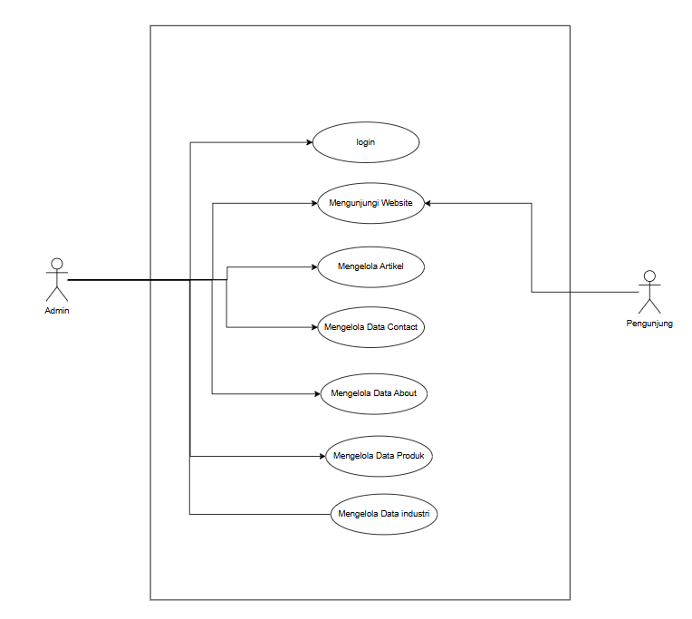
Sistem Informasi Parenting memiliki 2 pengunjung yaitu admin dan pengunjung. Admin mempunyai fungsi mengelola data informasi dan Pengunjung bisa melihat informasi serta memberikan komentar.

**2.1.2 Antarmuka Pengguna**

**Halaman Admin**

|  |  |
|--|--|
| 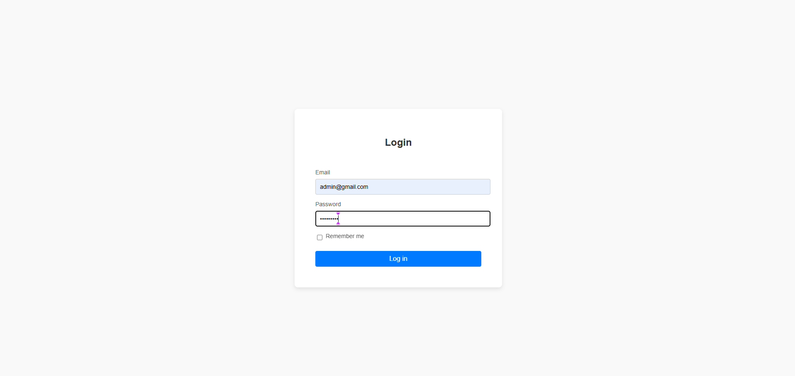halaman login admin diminta untuk mengisi username dan password.| 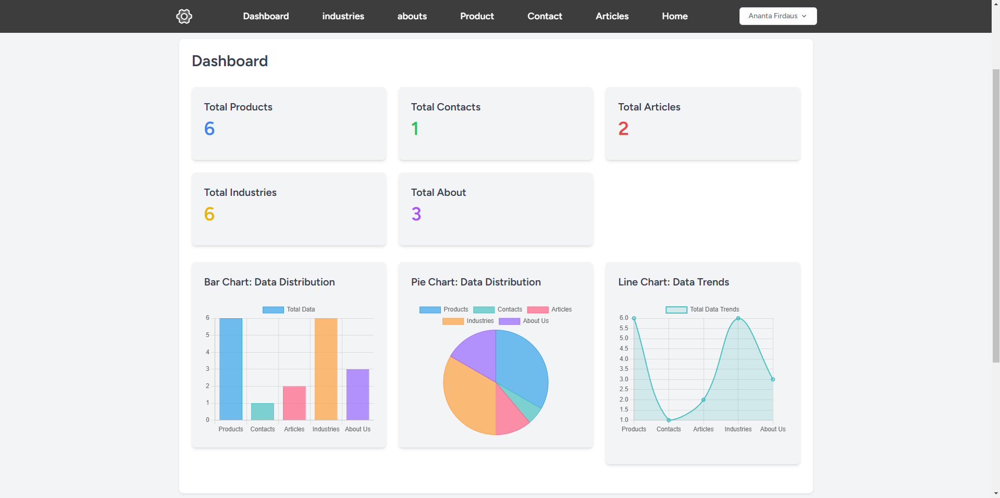 Setelah login admin akan masuk ke tampilan Dashboard admin.
|  |  |
| 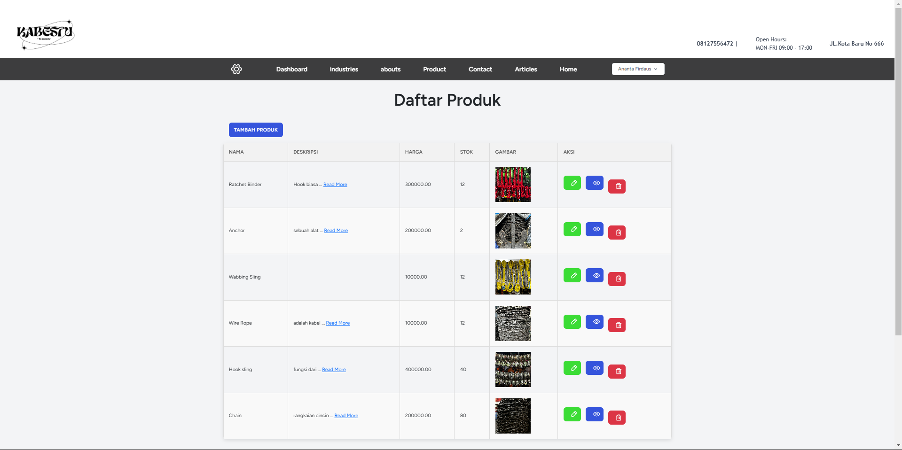Pada halaman admin akan terdapat halaman unutk mengelola data produk, namun tidak hanya dat produk tapi admin juga dapat mengelola data artikel, data kontak, data about dan data industri dengan tamnpilan yang sama di halaman yang berbeda.| 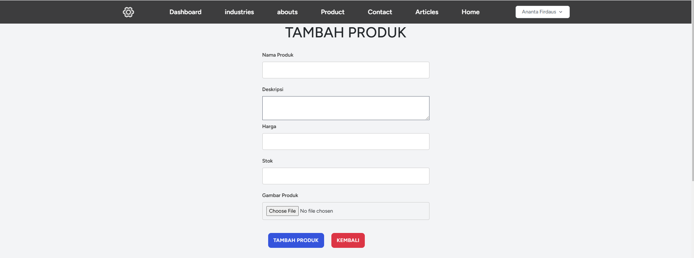 Pada halaman mengelola data produk, admin juga dapat menambahkan deskripsi, begitu juga dengan pengelolaan data di tabel lainnya.
|  |  |
| 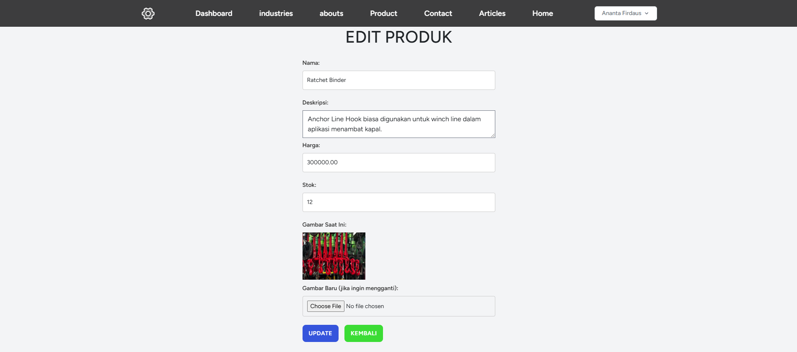 Pada halaman mengelola data produk juga terdapat aksi untuk mengedit data produk.|  Pada halaman mengelola data produk, selain menambahkan dan mengedit, admin juga dapat menghapus data produk yang mana ketika button hapus di klik akan muncul pop up untuk memastikan admin benar-benar ingin menghapus atau tidak.

**Halaman User**
|  |  |
|--|--|
| 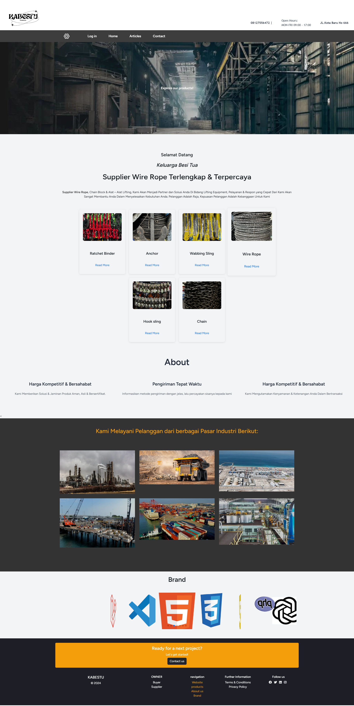Pada halaman pengunjung terdapat beranda yang berisi tampilan scrolling yang berisi seluruh konten seperti tampilan home, produk,about ,industrri dan brand.|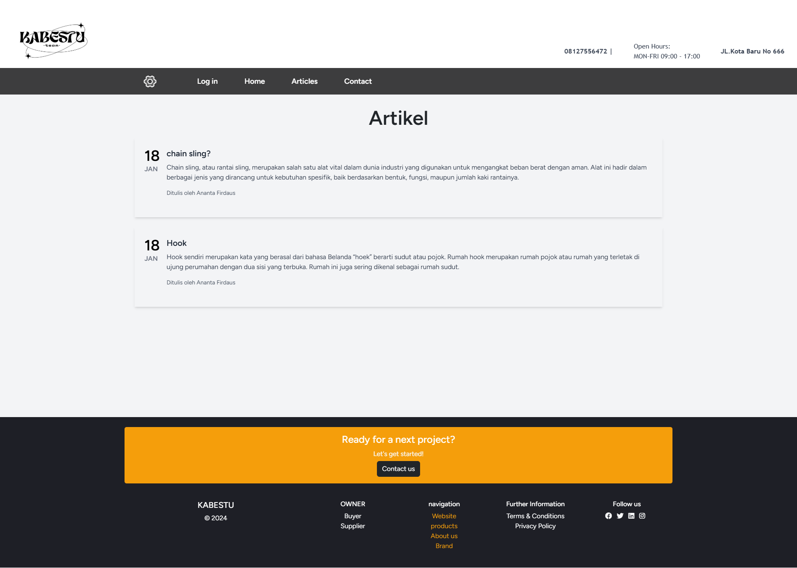Pada halaman pengunjung terdapat halaman artikel yang berisi judul, tanggal dan deskripsi beberapa artikel.
|  |  |
| 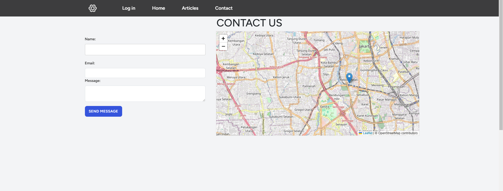Pada halaman pengunjung terdapat halaman kontak , pengunjung bisa mengirimkan pesan.|Pada halaman pengunjung terdapat produk ynag dimana ketika pengunjung tersebut menekan tombol read more makan akan menampilkan halaman deskripsi tentang produk tersebut.
|  |  |

**2.1.3 Antarmuka perangkat keras**

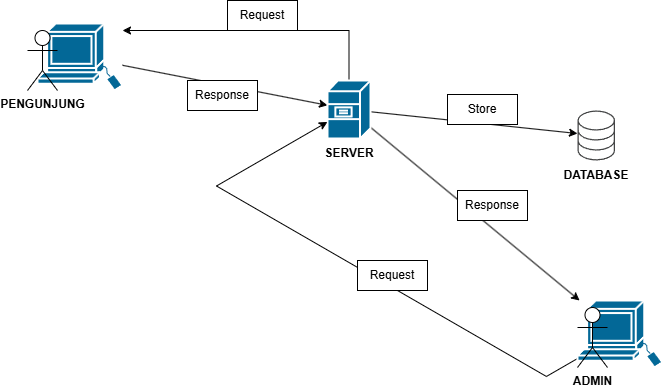
Antarmuka perangkat keras yang digunakan untuk mengoperasikan Perangkat Lunak Sistem Parenting antara lain :

PC / Laptop Untuk menjalankan Aplikasi ini.

**2.1.4 Antarmuka perangkat lunak**

tidak ada

**2.1.5 Antarmuka Komunikasi**

Antarmuka komunikasi yang digunakan untuk mengoperasikan Perangkat Lunak Sistem Informasi Parenting antara lain :

- PC

- wifi/Jaringan

**2.1.6 Batasan Memori**

tidak ada

**2.1.7 Operasi-operasi**
| Operasi | Fungsi |
| ------ | ------ |
|   Login  | Digunakan untuk mengakses aplikasi    |
|    Input Data    |    Digunakan untuk memasukkan data-data    |
| Kembali |  Digunakan untuk kembali ke halaman sebelumnya |
| Hapus | Digunakan untuk menghapus data|
| Edit       |   Digunakan untuk mengubah data     |
| View      |   Digunakan untuk menampilkan data     |
| Simpan      |     Digunakan untuk menyimpan data   |

**2.1.1 Kebutuhan adaptasi**

tidak ada

## 2.2 Spesifikasi kebutuhan fungsional
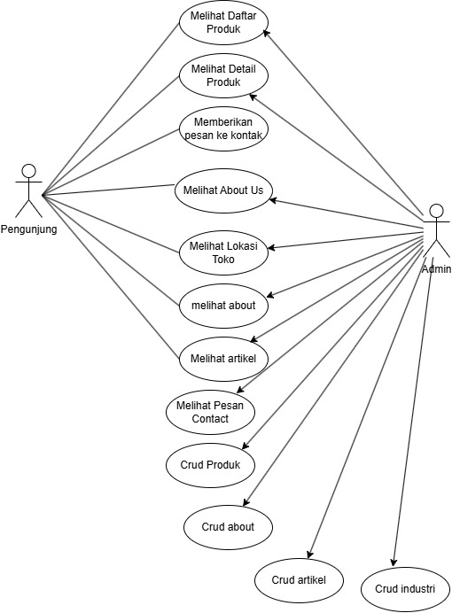

**2.2.1 Admin Login**

Use Case: Login

Diagram: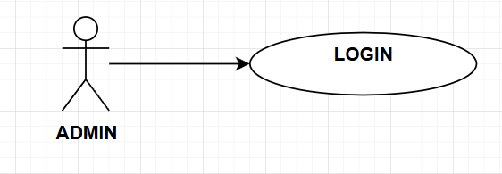

Deskripsi Singkat 
Admin melakukan login terlebih dahulu sebelum masuk ke tampilan home admin, apabila gagal login akan muncul pesan alert error login. 

Deskripsi Langkah-Langkah
1. Admin melakukan login dengan username dan password.
2. Sistem melakukan validasi login.
3. Bila sukses sistem akan mengarahkan ke home admin.
4. Bila gagal sistem akan menampilkan peringatan.

**2.2.2 Admin Input Artikel**

Use Case: Input Artikel 

Diagram:

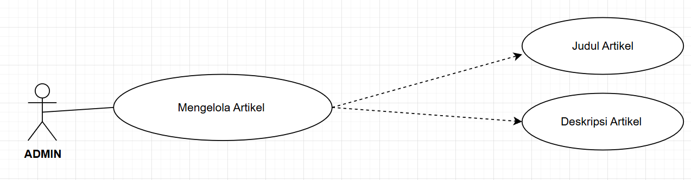

Deskripsi Singkat
Admin menginputkan artikel  lalu menambahkan judul dan deskripsi sesuain artikel.

Deskripsi Langkah- langkah:
1. Sistem akan menampilkan tampilan input artikel.
2. Admin Dapat melihat,menambahkan, dan mengupload artikel.
3. Sistem akan menyimpan ke database.
4. Jika sudah disimpan sistem akan menampilkan peringatan.

**2.2.3 Admin Input produk**

Use Case: Input produk

Diagram:
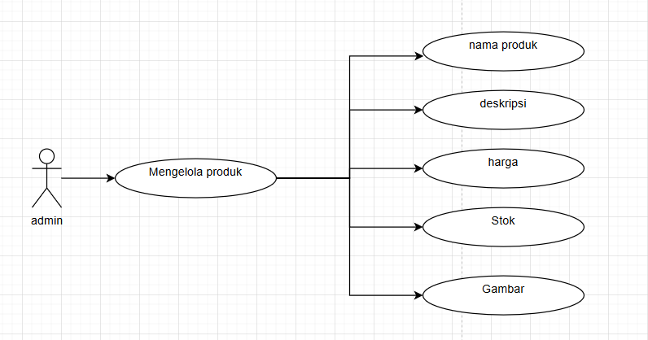
Deskripsi Singkat
Sistem dapat menampilkan halaman input produk

Deskripsi Langkah- langkah:
1. Sistem akan menampilkan tampilan publikasi produk.
2. Admin dapat melihat,menambahkan, dan mengupload produk.
3. Sistem akan menyimpan ke database.
4. sudah disimpan sistem akan menampilkan peringatan.

**2.2.4 Admin Input data about**

Use Case: Input data about

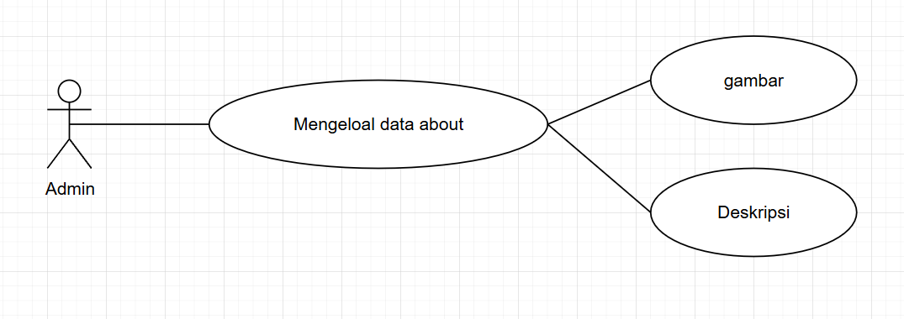

Deskripsi Singkat
Sistem dapat menampilkan halaman Input data about
Deskripsi Langkah- langkah:
1. Sistem akan menampilkan tampilan data about
2. Admin dapat melihat,menambahkan, dan mengupload data tentang B3AM.
3. Sistem akan menyimpan ke database.
4. sudah disimpan sistem akan menampilkan peringatan.

**2.2.5 Admin Input data contact**

Use Case: Input data contact 

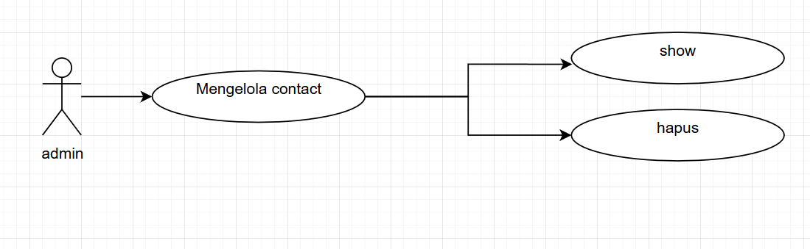

Deskripsi Singkat
Sistem dapat menampilkan halaman data contact  dan Admin bisa melihat contact .
Deskripsi Langkah- langkah:
1. Sistem akan menampilkan tampilan data contact yang di input pengunjung.
2. Admin dapat melihat,dan menghapus data contact.
3. Sistem akan menyimpan ke database.
4. sudah disimpan sistem akan menampilkan peringatan.

**2.2.6 Admin Input data industri**

Use Case: Input data industri

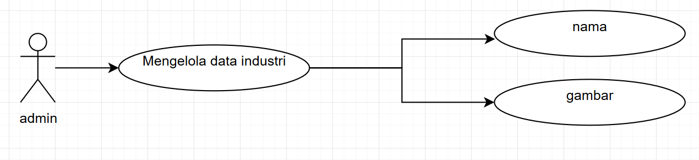

Deskripsi Singkat
Sistem dapat menampilkan halaman Input data industri dan Admin mengInput data indsutri.
Deskripsi Langkah- langkah:
1. Sistem akan menampilkan tampilan data industri.
2. Admin dapat melihat,menambahkan, dan mengupload data industri.
3. Sistem akan menyimpan ke database.
4. sudah disimpan sistem akan menampilkan peringatan.

**2.2.7 pengunjung Mengunjungi website**

Use Case: Mengunjungi website

Diagram:
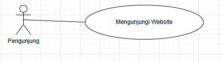

Deskripsi Singkat 
pengunjung mengunjungi website dan melihat informasi yang ada pada website seperti informasi seputar website serta informasi produk yang telah tersedia, pengunjung juga dapat memberikan komentar pada kontak

Deskripsi Langkah-Langkah
1. Sistem akan menampilkan halaman-halaman konten.
2. pengunjung melihat informasi yang ada pada website seperti informasi seputar website atau informasi parenting serta juga dapat memberikan komentar pada kontak yang tersedia 
3. pengunjung dapat mengklik tombol kembali ke halaman sebelumnya jika ingin keluar pada halaman konten yang telah dilihat.

## 2.3 Spesifikasi kebutuhan non-fungsional
- tabel kebutuhan non-fungsional

| no | deskripsi |
| ------ | ------ |
|     1   |   Semua interface dan fungsi menggunakan Bahasa Indonesia dan bahasa inggris    |
|     2   |   Perangkat Lunak dapat dipakai di semua platofrm OS ( Admin, pengunjung )     |

## 2.4 Karakteristik Pengguna
Karakteristik pengguna dari perangkat lunak ini adalah pengguna langsung berinteraksi dengan sistem dan dihubungkan dengan hak akses atau level autentikasi.

## 2.5 Batasan-batasan
tidak ada

## 2.6 Asumsi-asumsi
tidak ada

## 2.7 Kebutuhan Penyeimbang
tidak ada

## BAB III Requirement Specification

## 3.1 Persyaratan Antarmuka Eksternal
Salah satu cara mengakses website ini yaitu dengan mengklik link websitenya  kemudian pengunjung dapat melihat konten yang ada di website tersebut.

## 3.2 Functional Requirement
**3.2.1 Login Admin**

| Nama Fungsi         | Login                                  |
| ------------------- | -------------------------------------- |
| Trigger             | Admin Membuka Website KABESTU |
| Precondition        | Halaman login                          |
| Basic Path          | 1. Admin melakukan login dengan username dan password.
|        |         2. Sistem melakukan validasi login. |
|        | 3. Bila sukses, sistem akan mengarahkan ke home admin.  |
|        | 4. Bila gagal, sistem akan menampilkan peringatan. |
|     Alternative       |                   Tidak Ada                   |
| Post Condition     |                  admin dapat login dan mengakses webiste KABESTU                   |
|         Exception Push          |                  Username dan password salah                   |

**3.2.2 Admin Input Informasi Artikel KABESTU**
| Nama Fungsi | Input Informasi KABESTU |
| ------ | ------ |
| Triger       | Membuka website sistem informasi KABESTU        |
| Precondition | Menginput data artikel KABESTU |
| Basic Path | 1. Sistem akan menampilkan tampilan input artikel. |
|            | 2. Admin dapat melihat,menambahkan, dan mengupload artikel. |
|            | 3. Sistem akan menyimpan ke database. |
|            | 4. Jika sudah disimpan sistem akan menampilkan peringatan. |
| Alternative | Tidak ada |     
| Post Condition | Admin mengelola artikel
| Exception Push | Tidak ada koneksi |

**3.2.3 Input produk KABESTU**

| Nama Fungsi        | Input Informasi Website                              |
| ------------------- | ---------------------------------- |
| Trigger            | admin dapat menginputkan data produk |
| Precondition       | Admin menginputkan Data produk|
| Basic Path         | 1. Sistem akan menampilkan tampilan publikasi produk. |
|                    | 2. Admin dapat melihat,menambahkan, dan mengupload kegiatan.   |
|                    | 3. Sistem akan menyimpan ke database.   |
|                    | 4. Jika sudah disimpan sistem akan menampilkan peringatan.   |
| Alternative        |  Tidak Ada                                 |
| Post Condition     |  Admin Dapat menginputkan data seputar website seperti alamat, pengelola, dan contact person.        |
| Exception Push     | Tidak Ada        |

**3.2.4 Input data industri**

| Nama Fungsi        | Input Informasi Website                              |
| ------------------- | ---------------------------------- |
| Trigger            | admin dapat menginputkan data industri |
| Precondition       | Admin menginputkan data industri ke website |
| Basic Path         | 1. Sistem akan menampilkan tampilan data industri. |
|                    | 2. Admin dapat melihat,menambahkan, dan mengupload data tentang BP3AM.   |
|                    | 3. Sistem akan menyimpan ke database.   |
|                    | 4. Jika sudah disimpan sistem akan menampilkan peringatan.   |
| Alternative        |  Tidak Ada                                 |
| Post Condition     |  Admin Dapat menginputkan data seputar website seperti alamat, pengelola, dan contact person.        |
| Exception Push     | Tidak Ada        |

**3.2.5 Input data contact BP3AM**

| Nama Fungsi        | Input Informasi Website                              |
| ------------------- | ---------------------------------- |
| Trigger            | admin dapat menghapus data contact |
| Precondition       | Admin melihat data contact BP3AM ke website |
| Basic Path         | 1. Sistem akan menampilkan tampilan data contact. |
|                    | 2. Admin dapat melihat, dan menghapus data contact.   |
|                    | 3. Sistem akan menyimpan ke database.   |
|                    | 4. Jika sudah disimpan sistem akan menampilkan peringatan.   |
| Alternative        |  Tidak Ada                                 |
| Post Condition     |  Admin Dapat menginputkan data seputar website seperti alamat, pengelola, dan contact person.        |
| Exception Push     | Tidak Ada        |

**3.2.6 Input data about**

| Nama Fungsi        | Input Informasi Website                              |
| ------------------- | ---------------------------------- |
| Trigger            | admin dapat menginputkan data about  |
| Precondition       | Admin menginputkan data about  ke website |
| Basic Path         | 1. Sistem akan menampilkan tampilan data about. |
|                    | 2. Admin dapat melihat,menambahkan, dan mengupload data team BP3AM.   |
|                    | 3. Sistem akan menyimpan ke database.   |
|                    | 4. Jika sudah disimpan sistem akan menampilkan peringatan.   |
| Alternative        |  Tidak Ada                                 |
| Post Condition     |  Admin Dapat menginputkan data seputar website seperti alamat, pengelola, dan contact person.        |
| Exception Push     | Tidak Ada        |

**3.2.6 Mengunjungi website**

| Nama Fungsi        |    pengunjung  Mengunjungi website             |
| ------------------- | ---------------------------------- |
=| Trigger            |pengunjung Dapat mengunjungi website dan melihat informasi yang ada pada website seperti informasi seputar website serta informasi KABESTU yang telah tersedia |
| Precondition       |pengunjung Mengunjungi website |
| Basic Path         | 1. Sistem akan menampilkan halaman-halaman konten. |
|                    |  2.pengunjung melihat informasi yang ada pada website seperti informasi seputar website atau informasi KABESTU serta juga dapat memberikan komentar pada kontak KABESTU yang tersedia    |
|                    | 3.pengunjung dapat mengklik tombol kembali ke halaman sebelumnya jika ingin keluar pada halaman konten yang telah dilihat.    |
| Alternative        |   Halaman Konten    |
| Post Condition     |   pengunjung mengunjungi website dan melihat informasi yang ada pada website     |
| Exception Push     |    Jika ada kesalahan server atau gangguan teknis, sistem akan menampilkan pesan kesalahan kepada pengguna. Pengguna dapat mencoba kembali atau menghubungi dukungan teknis.    |

## 3.3 Struktur Detail Kebutuhan Non-Fungsional
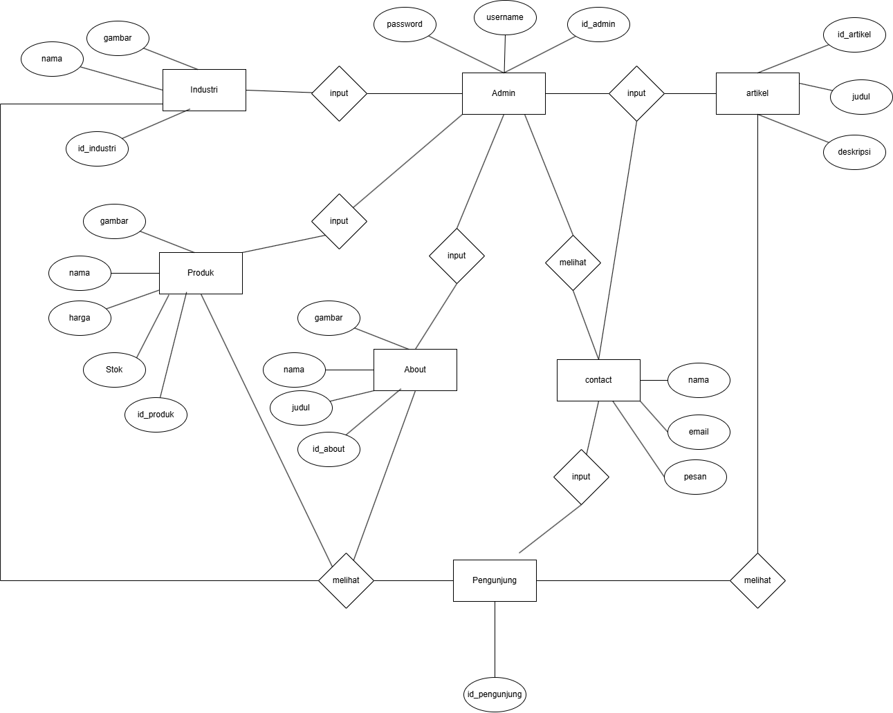
**3.3.1 Logika Struktur Data**
Struktur data logika pada sistem informasi parenting terdapat struktur Database yang dijelaskan menggunakan ERD.

**Tabel Admin**
|Data Item|Tipe Data|Deskripsi|
|--|--|--|
|Id_Admin|int|Auto-increment dari Id_Admin|
|username|varchar|Berisi username admin untuk mengakses sistem|
|Password|varchar|Berisi password admin untuk mengakses sistem|

**Tabel Artikel**
|Data Item|Tipe Data|Deskripsi|
|--|--|--|
|id_Artikel|int|Auto-increment dari Id_artikel|
|deskripsi|text|Berisi deskripsi artikel sistem|
|judul|varchar|Berisi judul pada artikel sistem|

**Tabel produk**
|Data Item|Tipe Data|Deskripsi|
|--|--|--|
|id_kegiatan|int|Auto-increment dari id_produk|
|gambar|varchar|Berisi gambar didalam produk |
|harga|text|Berisi harga produk|
|nama|varchar|Berisi nama pada produk |
|stok|varchar|Berisi stok pada  produk|

**Tabel about**
|Data Item|Tipe Data|Deskripsi|
|--|--|--|
|id_about|int|Auto-increment dari id_about|
|gambar|varchar|Berisi gambar didalam about |
|judul|varchar|Berisi judul didalam about |
|deskripsi|text|Berisi deskripsi about |

**Tabel contact**
|Data Item|Tipe Data|Deskripsi|
|--|--|--|
|nama|int|berisi nama pada contact|
|email|varchar|Berisi email pada contact sistem|
|pesan|varchar|Berisi pesan contact sistem|

**Tabel industri**
|Data Item|Tipe Data|Deskripsi|
|--|--|--|
|id_industri|int|Auto-increment dari Id_industri|
|gambar|varchar|Berisi gambar didalam industri sistem|
|nama|text|Berisi nama industri sistem|

## Pembagian tugas
BAB 1 ->Ananta

BAB 2 
2.1
  
  2.1.1 -> Ananta
  
  2.1.2 -> Ananta
  
  2.1.3 ->  Ananta
  
  2.1.4 ->  Ananta
 
  2.1.5 ->Yoga
  
  2.1.6 -> Yoga
  
  2.1.7 -> Yoga
  
  2.1.8 -> Yoga

2.2 semua poin-poin (Yoga)

BAB 3 

3.1 Yoga

3.2 Ananta

3.3Yoga Ananta

